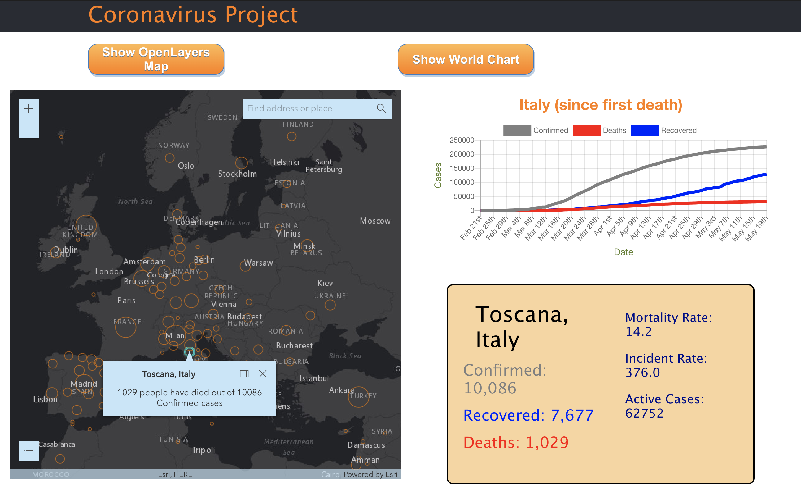

# Coronavirus Project

### An intearactive map with a graphical represenatation of timeseries data

---



## Installation

Ensure `node` and `npm` are installed

Navigate to preferred local directory

Clone this repo

Run the following commands

```
npm install

npm start
```


---

## Technologies used

ArcGIS Javascript API (v 4.15)

React

Chart.js

D3

---

## Map Layers & Data

[ArcGIS Covid19 feature layer](https://services1.arcgis.com/0MSEUqKaxRlEPj5g/ArcGIS/rest/services/Coronavirus_2019_nCoV_Cases/FeatureServer/1)

[Data Sources](https://datahub.io/core/covid-19#resource-countries-aggregated)

---

## Created by

Rob Gonzalez-Pita

## Phases 

- [x] Implement ESRI Map 

- [x] Use chart.js for data visualization

- [x] Create a text box to display numerical data

- [ ] Incorporate another ArcGIS FeatureLayer (Coronavirus by U.S. County Feature Layer)

- [ ] Implement the OpenLayers Map (only us GeoJSON and CSV files) 

- [ ] Create the ability to 'Save' or 'Watch' a specific country 

- [ ] Refactor chart using Plotly.js 

- [ ] Polish styling of the text box 


